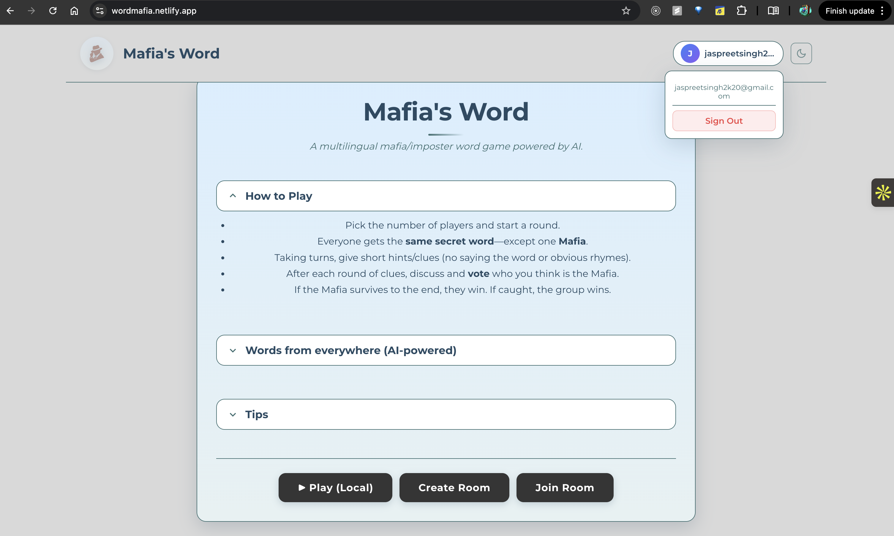
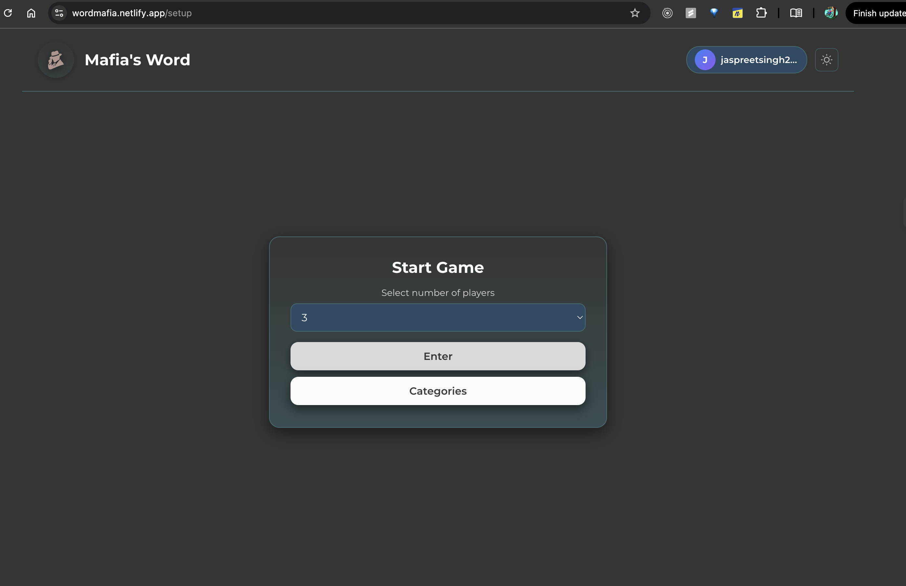
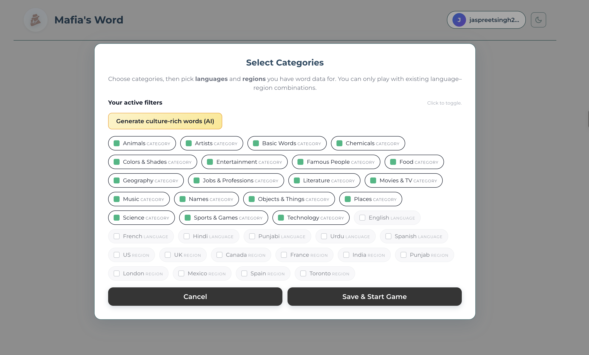
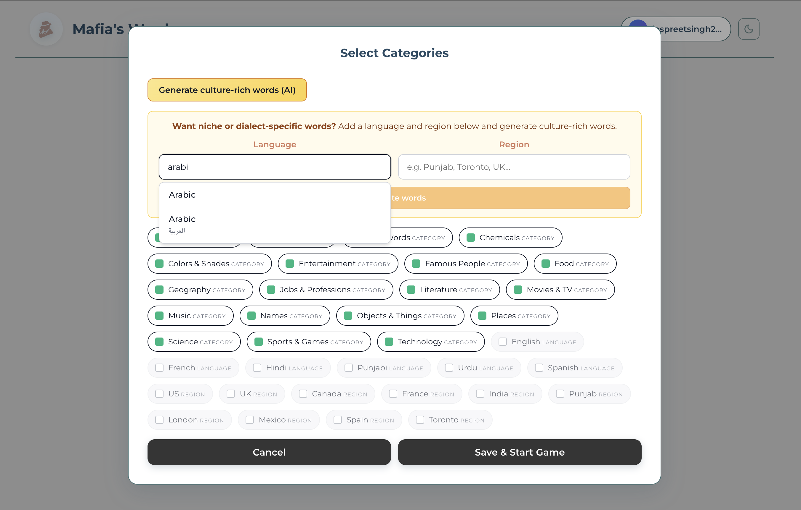
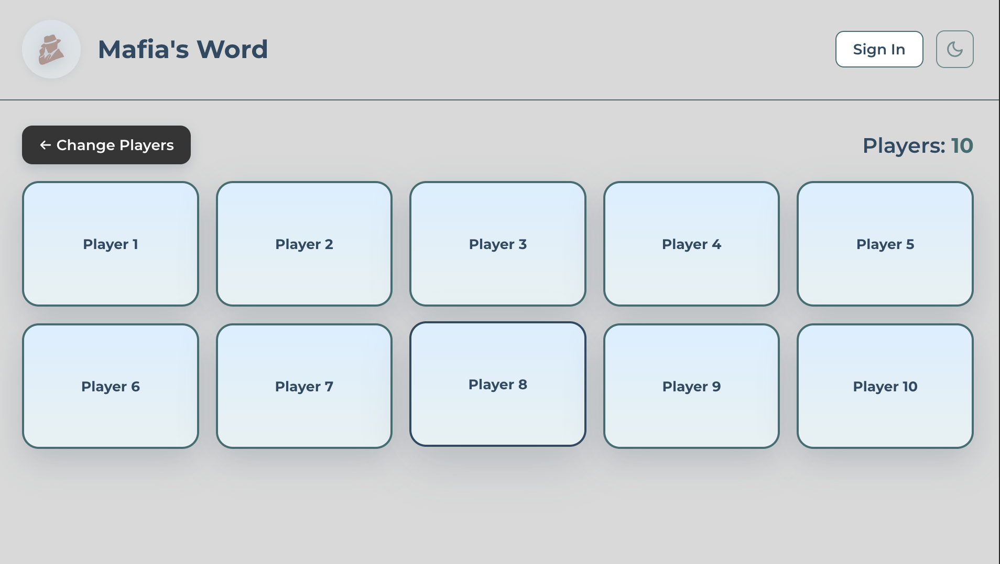
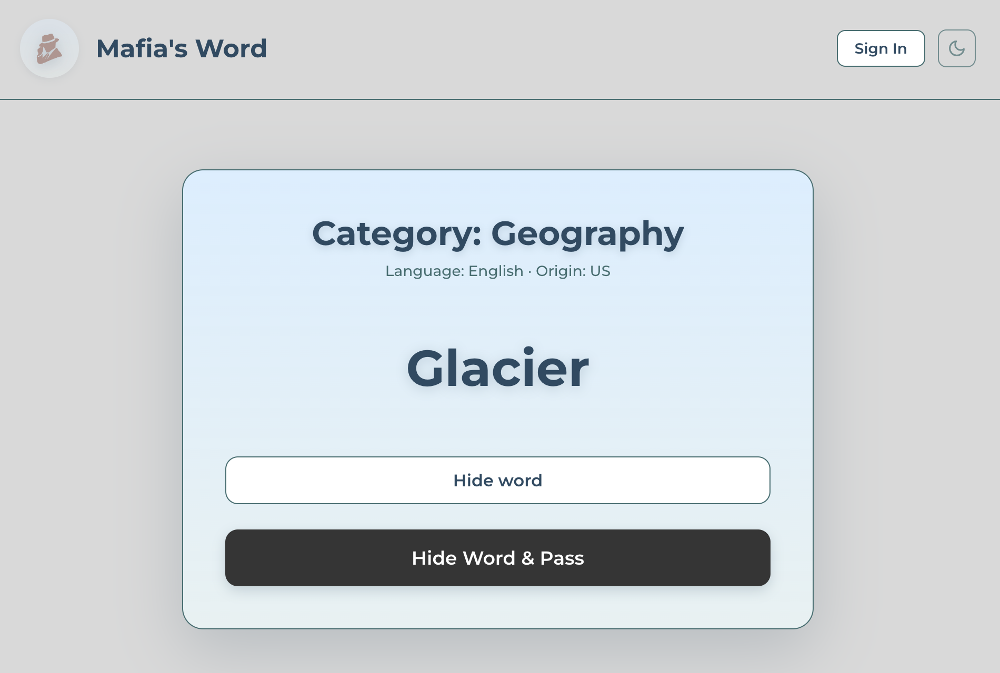

# Mafia's Word 🎭

A modern, multiplayer social deduction word game where players must identify the "Mafia" among them through strategic clue-giving and voting. Built with React, TypeScript, and designed for seamless cross-device gameplay.

## 🎮 How It Works

- **Setup**: Choose 2-25 players and optionally select word categories
- **Gameplay**: All players receive the same secret word except one randomly assigned "Mafia" player
- **Objective**: Players give clues about the word without revealing it, then vote to identify the Mafia
- **Victory**: The Mafia wins if they survive; the group wins if they catch the Mafia

## ✨ Features

- **Multiplayer Support**: Accommodates 2-25 players with dynamic game state management
- **Category Selection**: Filter words by categories for customized gameplay
- **Dark/Light Mode**: Theme toggle with persistent user preferences
- **Responsive Design**: Optimized for desktop, tablet, and mobile devices
- **Card Flip Animations**: Smooth 3D card reveal effects for player interactions
- **Session Persistence**: Game state saved in session storage for seamless navigation
- **One-Time Reveal**: Cards lock after being revealed to prevent cheating
- **Type-Safe**: Built with TypeScript for robust type checking
- **Centralized Strings**: Maintainable codebase with centralized UI text management

## 🚀 Run this project once

```bash
npm install
cp .env.example .env
npm run dev
```

Then open the URL shown (e.g. http://localhost:5173). For Firebase (word DB), Geoapify (region autocomplete), or the "Generate words" flow, see **[docs/RUN_ONCE.md](docs/RUN_ONCE.md)** for env vars and optional commands (Ollama + word-gen server). To host the word-gen server on Oracle Cloud (free tier VM) and move to production, see **[docs/ORACLE_AND_PRODUCTION.md](docs/ORACLE_AND_PRODUCTION.md)**.

## 👤 User Experience (UX) Walkthrough

This section walks through the game from first visit to final reveal. Screenshots illustrate each step.

---

### 1. Landing & Sign-In (Optional)

**Where:** Home page (`/`)

- Users land on the main card with the game name, subtitle, and collapsible sections: **How to Play**, **Words from everywhere (AI-powered)**, and **Tips**.
- **Play (Local)** is always available: no account required. Tapping it goes straight to setup.
- **Sign in to Play Online** appears when the user is not logged in; after sign-up or sign-in, that button is replaced by the authenticated state (Create Room / Join Room are currently hidden).
<p align="center">
  
</p>
<p align="center"><em>Home page with Play (Local) and optional sign-in.</em></p>

---

### 2. Game Setup & Player Count

**Where:** Setup page (`/setup`)

- User chooses **number of players** (2–25) via a dropdown.
- **Enter** starts the game immediately with default categories and filters.
- **Categories** opens the category/language/region selector modal (next step).
<p align="center">
  
</p>
<p align="center"><em>Setup screen with player count and Enter / Categories buttons.</em></p>
---

### 3. Categories, Languages & Regions

**Where:** Categories modal (opened from Setup)

- **Categories:** All game categories (Food, Animals, Music, Science, etc.) appear as chips. Users toggle which categories are active; only words from selected categories (or all if none selected) are used.
- **Play mode – existing data only:** Languages and regions are **existing only**: the user sees chips for each language and region that already have word data (e.g. English, French, Hindi, Punjab, India). They toggle which to use; the game only uses words that match these filters. No free-text add here.
- **Generate culture-rich words (AI):** A separate section explains niche/dialect-specific words. Expanding it shows:
  - **AI form:** Dedicated language and region autocomplete inputs (original autocomplete behaviour). A **Generate words** button is present but inactive for now; it will later trigger on-demand AI generation for new language/region combinations.
- After choosing categories and optional languages/regions, user taps **Save & Start** to begin the game with those filters.
<p align="center">
  
</p>
<p align="center">
  
</p>
<p align="center"><em>Categories modal with category chips, language/region chips, and AI section collapsed or expanded.</em></p>
---

### 4. Game Board & Player Cards

**Where:** Game page (`/game`)

- The board shows one card per player (e.g. “Player 1”, “Player 2”, …). Cards are face-down until a player opens their own.
- A **Reveal the Mafia** button is available (typically after everyone has had a chance to see their card).
- Turn order and direction (clockwise/counter-clockwise) can be suggested after reveals.
<p align="center">
  
</p>
<p align="center"><em>Game board with player cards and Reveal the Mafia button.</em></p>
---

### 5. Card Reveal (Word or Mafia)

**Where:** Player page (`/player/:playerId`) — each player opens their own card

- **Header:** Shows the **category** of the current word and, when available, **Language** and **Origin** (region) of the word (e.g. “Language: English · Origin: US”).
- **Content:** The card shows either the **secret word** (same for all non-Mafia players) or **“You are the Mafia”** for the single Mafia player.
- **Auto-hide:** After a short time (e.g. 10 seconds), the word/mafia status is hidden to reduce peeking; the user sees a “Word hidden” style message.
- **Toggle:** A **Show word / Hide word** button lets the player show or hide the word/mafia status again without leaving the page.
- **Done:** A separate button returns the player to the game board (and marks the card as revealed where applicable).
<p align="center">
  
</p>
<p align="center"><em>Card reveal with word visible; optional view with word hidden and Show word button.</em></p>
---

### 6. Start of Round & Direction

**Where:** Game page (after card reveals)

- When appropriate (e.g. after a round of reveals), a post-reveal prompt can suggest a **starting player** and **direction** (clockwise or counter-clockwise) for giving clues.
- This sets the turn order for the clue-giving phase.
<p align="center">
  
</p>
<p align="center"><em>Prompt or banner showing suggested starting player and direction.</em></p>

---

### 7. Mafia Revelation (Voting)

**Where:** Game page

- The **Reveal the Mafia** action lets the group move to the voting/reveal phase when they are ready.
- Confirmation may be shown (e.g. “Are you sure?”) to avoid accidental clicks.
<p align="center">
  
</p>
<p align="center"><em>Reveal the Mafia button and/or confirmation dialog.</em></p>
---

### 8. Final Reveal (Who Was the Mafia)

**Where:** Mafia reveal page (e.g. `/reveal-mafia`)

- The final screen reveals **who the Mafia was** (e.g. by name or player number).
- A **New game** (or similar) button takes users back to setup or home to play again.
<p align="center">
  
</p>
<p align="center"><em>Final reveal screen with Mafia identity and New game button.</em></p>
---

### Flow Summary

| Step | Screen / Action        | Purpose |
|------|------------------------|---------|
| 1    | Home                   | Enter game; optional sign-in |
| 2    | Setup                  | Set player count; choose Enter or Categories |
| 3    | Categories modal       | Select categories, languages, regions; optional AI section |
| 4    | Game board             | See player cards; Reveal the Mafia when ready |
| 5    | Card reveal (per player) | See word or Mafia; language/origin; show/hide toggle |
| 6    | Round start            | Suggested first player and direction for clues |
| 7    | Reveal the Mafia       | Start voting/reveal phase |
| 8    | Final reveal           | See Mafia identity; start new game |

---

## 🛠️ Tech Stack

- **Frontend Framework**: React 19 with TypeScript
- **Routing**: React Router DOM v7
- **State Management**: React Context API with custom hooks
- **Styling**: CSS Modules with CSS Variables for theming
- **Build Tool**: Vite with Rolldown
- **Storage**: Session Storage & Local Storage for game state and preferences

## 🚀 Getting Started

### Prerequisites

- Node.js (v18 or higher)
- npm or yarn

### Installation

```bash
# Clone the repository
git clone <repository-url>

# Navigate to project directory
cd imposter-word-ai-game

# Install dependencies
npm install

# Start development server
npm run dev
```

The application will be available at `http://localhost:5173`

### Build for Production

```bash
npm run build
```

### Preview Production Build

```bash
npm run preview
```

## 📁 Project Structure

```
src/
├── components/          # Reusable UI components
│   ├── Navbar.tsx     # Navigation bar with theme toggle
│   └── PlayerCountSelect.tsx  # Game setup component
├── contexts/          # React Context providers
│   ├── GameContext.tsx    # Game state management
│   └── ThemeContext.tsx   # Theme management
├── pages/             # Route components
│   ├── HomePage.tsx       # Landing page with game rules
│   ├── GamePage.tsx      # Main game board with player cards
│   ├── PlayerPage.tsx    # Individual player word reveal
│   └── MafiaRevealPage.tsx  # Mafia identity reveal
├── constants/         # Centralized constants
│   └── strings.ts        # UI strings, routes, storage keys
└── assets/           # Static assets
    └── words.ts          # Word database by category
```

## 🎨 Design Features

- **Modern UI**: Clean, minimalist design with smooth transitions
- **Accessibility**: Semantic HTML and ARIA labels
- **Theme System**: CSS variables for easy theme customization
- **Responsive Breakpoints**: Optimized layouts for various screen sizes

## 🔧 Development

### Code Style

- TypeScript strict mode enabled
- ESLint for code quality
- CSS Modules for scoped styling

### Key Implementation Details

- **Game State**: Managed through React Context with session storage persistence
- **Card Locking**: One-time reveal system prevents re-accessing player cards
- **Randomization**: Secure random selection for Mafia assignment and word picking
- **Navigation Guards**: Automatic redirects to maintain game flow integrity

## 📝 License

This project is private and not licensed for public use.

## 👤 Author

Built as a proof of concept and portfolio project demonstrating modern React development practices, TypeScript proficiency, UI/UX design skills and integration of AI.